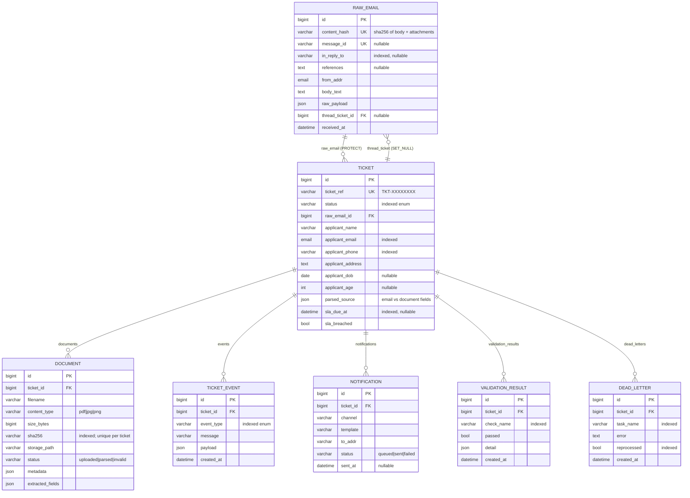

# Database Schema

PostgreSQL is the source of truth. The schema is owned by Django migrations
(`onboarding/migrations/`); this document is the human-readable reference. The
**unique constraints** below are what make the system idempotent and deduplicated
regardless of application logic.

## Entity-relationship diagram

Rendered image (for viewers without Mermaid): [`schema.png`](schema.png) (high-res) ·
[`schema.svg`](schema.svg) (vector). Source: [`schema.mmd`](schema.mmd).

## Tables

All tables use a `bigint` auto PK. `TimestampedModel` tables also have
`created_at` (auto add) and `updated_at` (auto now): `raw_emails`, `tickets`,
`documents`, `notifications`.

### `raw_emails`
The original inbound email, persisted before any processing.

| Column | Type | Null/Default | Notes |
|--------|------|--------------|-------|
| `message_id` | varchar(512) | null | **unique** |
| `in_reply_to` | varchar(512) | null | indexed (thread lookup) |
| `references` | text | null | |
| `from_addr` | email(320) | — | sender, from the `From:` header |
| `subject` | varchar(1024) | `''` | |
| `body_text` | text | `''` | |
| `raw_payload` | json | `{}` | original request payload |
| `content_hash` | varchar(64) | — | **unique**, indexed — idempotency anchor |
| `received_at` | datetime | — | |
| `thread_ticket_id` | FK→tickets | null | `SET_NULL`; original ticket for a reply |

### `tickets`
A CRM onboarding ticket generated from an email.

| Column | Type | Null/Default | Notes |
|--------|------|--------------|-------|
| `ticket_ref` | varchar(20) | auto | **unique**, non-editable (`TKT-…`) |
| `status` | varchar(32) | `received` | indexed; enum (see below) |
| `raw_email_id` | FK→raw_emails | — | `PROTECT` |
| `applicant_name` | varchar(255) | `''` | |
| `applicant_email` | email(320) | `''` | indexed |
| `applicant_phone` | varchar(32) | `''` | indexed |
| `applicant_address` | text | `''` | |
| `applicant_dob` | date | null | from the document |
| `applicant_age` | int (≥0) | null | derived from DOB |
| `parsed_source` | json | `{}` | `{email:{…}, document:{…}, duplicate_of}` |
| `sla_due_at` | datetime | null | indexed |
| `sla_breached` | bool | `false` | |

### `documents`
An attachment linked to a ticket, deduplicated by content hash.

| Column | Type | Null/Default | Notes |
|--------|------|--------------|-------|
| `ticket_id` | FK→tickets | — | `CASCADE` |
| `filename` | varchar(512) | — | |
| `content_type` | varchar(8) | — | enum `pdf/jpg/png` |
| `size_bytes` | bigint (≥0) | — | |
| `sha256` | varchar(64) | — | indexed; **unique with `ticket`** (`uniq_ticket_sha256`) |
| `storage_path` | varchar(1024) | — | hash-addressed local path |
| `status` | varchar(16) | `uploaded` | enum `uploaded/parsed/invalid` |
| `metadata` | json | `{}` | declared/sniffed type, format_valid, ocr_error |
| `extracted_fields` | json | `{}` | OCR-derived identity fields |

### `ticket_events`
Immutable activity timeline / processing log. Ordered by `created_at, id`.

| Column | Type | Notes |
|--------|------|-------|
| `ticket_id` | FK→tickets | `CASCADE` |
| `event_type` | varchar(32) | indexed; enum (see below) |
| `message` | varchar(512) | |
| `payload` | json | |
| `created_at` | datetime | auto add |

### `notifications`
Queued/sent user notifications.

| Column | Type | Notes |
|--------|------|-------|
| `ticket_id` | FK→tickets | `CASCADE` |
| `channel` | varchar(32) | default `email` |
| `template` | varchar(64) | template key |
| `to_addr` | varchar(320) | recipient |
| `status` | varchar(16) | enum `queued/sent/failed` |
| `sent_at` | datetime | null |

### `validation_results`
Per-check outcome of a validation run.

| Column | Type | Notes |
|--------|------|-------|
| `ticket_id` | FK→tickets | `CASCADE` |
| `check_name` | varchar(64) | indexed (e.g. `name_consistency`, `duplicate_check`) |
| `passed` | bool | |
| `detail` | json | check-specific context |
| `created_at` | datetime | auto add |

### `dead_letters`
A pipeline task that failed after exhausting retries (the DLQ).

| Column | Type | Notes |
|--------|------|-------|
| `ticket_id` | FK→tickets | `CASCADE` |
| `task_name` | varchar(128) | indexed |
| `error` | text | truncated to 4000 chars |
| `reprocessed` | bool | indexed; flipped by reprocess |

## Enums

- **`TicketStatus`**: `received · processing · awaiting_validation · approved ·
  rejected · failed · requires_manual_review` (terminal: `approved`, `rejected`).
- **`DocumentType`**: `pdf · jpg · png`.
- **`DocumentStatus`**: `uploaded · parsed · invalid`.
- **`NotificationStatus`**: `queued · sent · failed`.
- **`EventType`**: `email_received · ticket_created · documents_uploaded ·
  document_parsed · validation_passed · validation_failed · notification_sent ·
  status_updated · duplicate_merged · sla_breached · processing_failed ·
  reprocess_requested`.

## Integrity invariants

- `raw_emails.content_hash` **unique** → one ticket per distinct email (idempotency,
  race-safe via `get_or_create` in a single transaction).
- `documents (ticket, sha256)` **unique** → per-ticket attachment dedup. Cross-ticket
  duplicate detection happens at validation time (`find_duplicate`), and the shared
  document hash is only one of the signals that must agree (alongside email + phone).
- `tickets.raw_email` uses `PROTECT`; all per-ticket children use `CASCADE`;
  `raw_emails.thread_ticket` uses `SET_NULL`.
